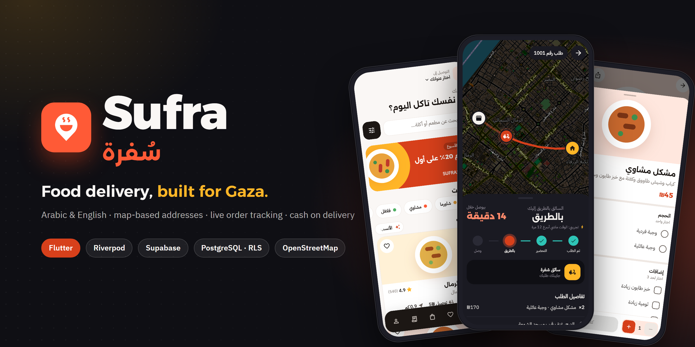
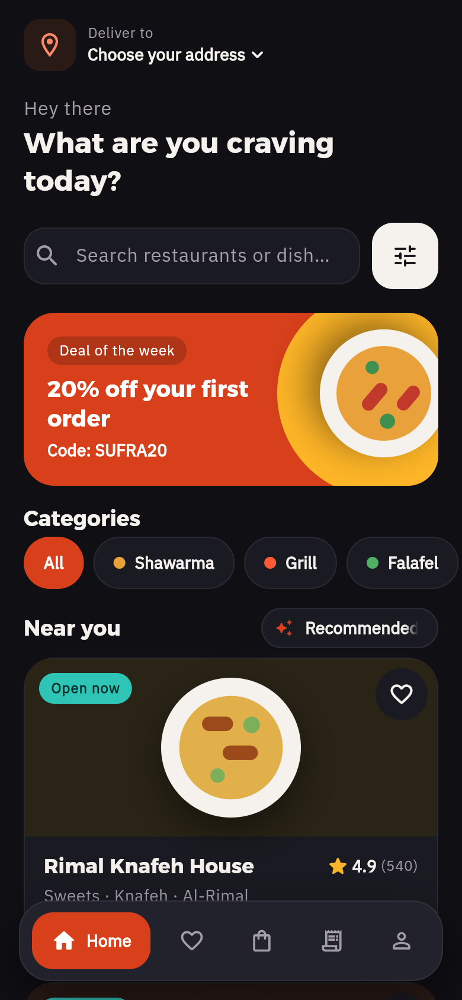
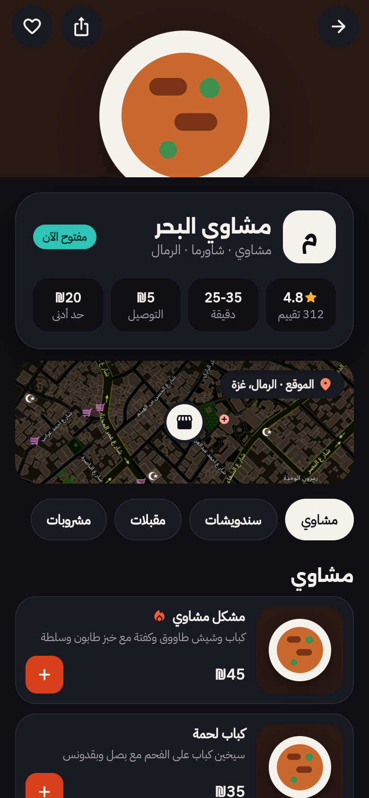
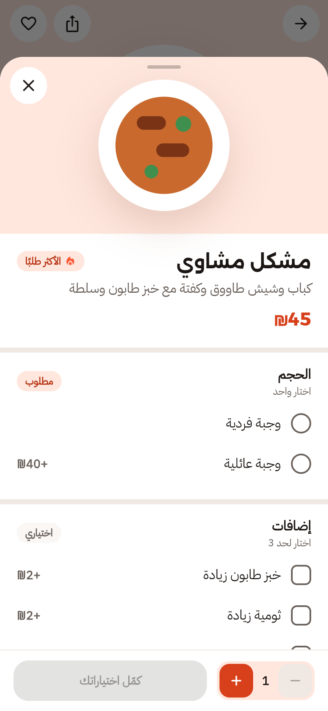
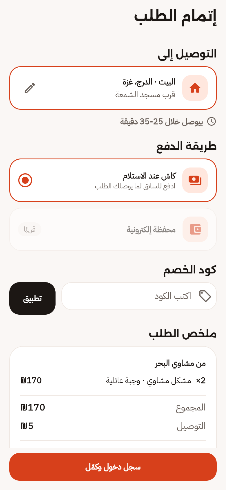
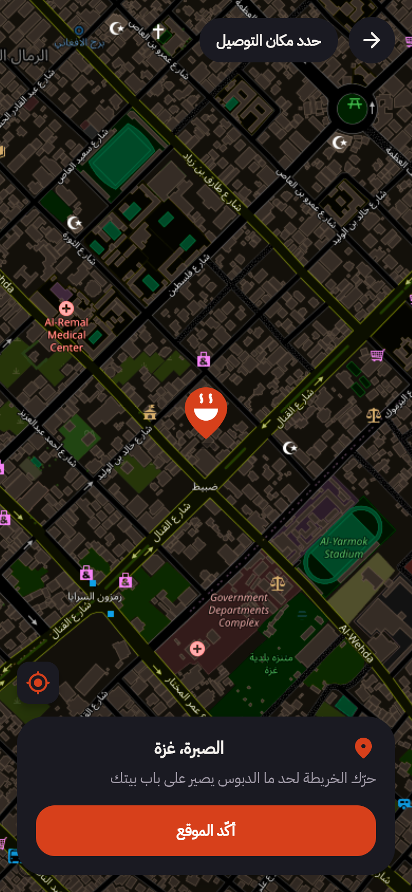
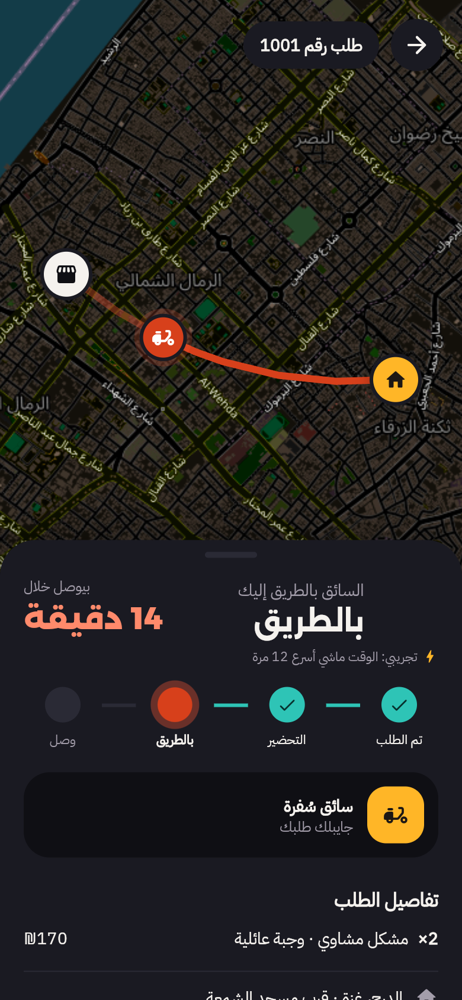
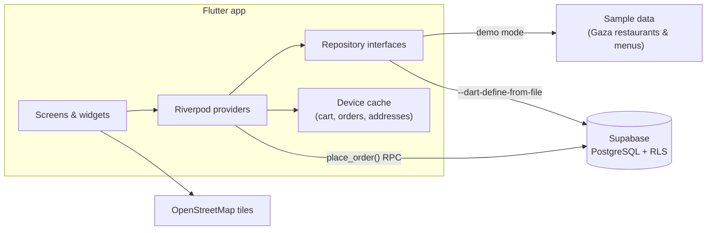
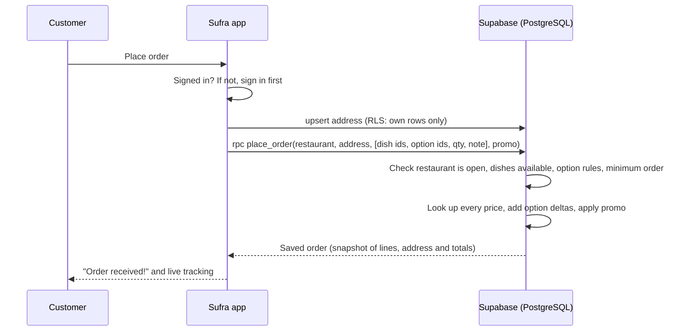

<div align="center">



<br />

**A bilingual food delivery app for Gaza, built end to end: product design, Flutter app, and a secure Supabase backend.**

[](https://flutter.dev)
[](https://dart.dev)
[](https://supabase.com)
[](https://riverpod.dev)
[](#-testing)


[Screenshots](#-screenshots) · [Features](#-features) · [Architecture](#-architecture) · [Security](#-security) · [Getting started](#-getting-started) · [Testing](#-testing) · [Roadmap](#-roadmap)

</div>

---

## Why Sufra

Delivery apps are designed for cities with street addresses, card payments and steady internet. Gaza has none of
those guarantees, so **Sufra (سُفرة, "the dining spread")** is built around how ordering actually works there:

| | |
|---|---|
| 📍 **Addresses are a pin and a landmark** | Drop a pin on the map and add "near the mosque, opposite the pharmacy". The area is detected offline. |
| 💵 **Cash on delivery** | The default payment, with prices in ₪ and promo codes priced on the server. |
| 📶 **Weak or missing internet** | Bundled fonts, a cart and order history that survive restarts, and clear offline and error states. |
| 🌍 **Arabic first, English too** | Full right-to-left layouts, Arabic plural forms, and both languages in the data itself. |

## 📱 Screenshots

<div align="center">
<table>
  <tr>
    <td align="center"><br /><sub><b>Home</b> · Arabic · Light</sub></td>
    <td align="center"><br /><sub><b>Home</b> · English · Dark</sub></td>
    <td align="center"><br /><sub><b>Restaurant</b> · menu & location</sub></td>
    <td align="center"><br /><sub><b>Dish options</b></sub></td>
  </tr>
  <tr>
    <td align="center"><br /><sub><b>Checkout</b></sub></td>
    <td align="center"><br /><sub><b>Address</b> on the map</sub></td>
    <td align="center"><br /><sub><b>Order tracking</b></sub></td>
    <td align="center"><br /><sub><b>App icon</b></sub></td>
  </tr>
</table>
</div>

## ✨ Features

<table>
<tr>
<td width="50%" valign="top">

**🔎 Discover**
- Restaurants and categories, with search across Arabic and English
- Sort by best match, nearest, top rated, fastest or cheapest delivery
- Filters for open now, rating and delivery fee, with a live result count
- Distance from your saved address on every card

**🍽️ Order**
- Menus with required single-choice groups (size) and optional extras with limits
- A note for the kitchen, and the price updates as you choose
- One restaurant per cart; identical configurations merge
- Minimum-order checks, promo codes, cash on delivery

</td>
<td width="50%" valign="top">

**🗺️ Deliver**
- Map-based address picker (OpenStreetMap) with GPS "my location"
- Offline neighborhood detection for 20 areas across the Gaza Strip
- Required landmark and Palestinian mobile-number validation
- Live tracking: restaurant, rider and home on the map, stage by stage

**👤 Feel at home**
- Arabic and English, light and dark, both remembered
- Sign-in asked for only at checkout; browsing needs no account
- Addresses and orders follow you across devices
- Loading skeletons and friendly error and empty states everywhere

</td>
</tr>
</table>

## 🏗 Architecture

The screens never talk to a backend directly. They read Riverpod providers, which read **repository interfaces**,
so the same app runs on built-in **sample data** (demo mode) or on the **live Supabase backend**, chosen at build time.



### Placing an order

The app sends **ids, never prices**. The database prices everything and returns the saved order.



## 🔒 Security

- **Row-Level Security** on every table: users read and change only their own addresses and read only their own
  orders. Restaurants and menus are read-only from the app.
- **Server-side pricing:** `place_order()` is the only way to create an order, and it recalculates every price,
  option, minimum order and discount in the database, so a modified app can't send its own prices.
- **No secrets in the repository:** the app uses Supabase's public (publishable) key, read from a git-ignored
  `supabase.json` at build time. The `service_role` key is never used.

## 🧰 Tech stack

| Layer | Choice |
|---|---|
| UI | Flutter 3.47, Material 3 (`material_ui`), `flutter_animate`, custom-painted logo and illustrations |
| State & navigation | Riverpod 3, go_router 18 (stateful tab shell with nested routes) |
| Backend | Supabase: PostgreSQL, Row-Level Security, PL/pgSQL RPC, Auth |
| Maps & location | `flutter_map` with OpenStreetMap tiles, `geolocator` |
| Localization | Flutter gen-l10n (ARB), RTL-aware layouts, Arabic plurals |
| Fonts | Alexandria and IBM Plex Sans Arabic, bundled (SIL Open Font License) |
| Tooling | Node scripts for screenshots and the banner, a Dart seed exporter, a Dart icon generator |

<details>
<summary><b>📁 Project structure</b></summary>

```
lib/
  core/          theme, router, settings, maps, backend config, shared widgets
  features/
    home/        restaurants, categories, search, filters (+ sample & Supabase repositories)
    restaurant/  restaurant page, menu, dish options sheet
    cart/        cart state and screen
    checkout/    checkout and promo codes
    address/     map picker, address form, saved addresses
    orders/      orders, simulated progress, tracking screen
    auth/        email sign-in and sign-up
supabase/        schema.sql (tables, RLS, place_order), seed.sql (generated)
test/            unit, mapping and layout-overflow tests
tool/            icon generator, seed exporter, screenshot & banner renderers
docs/            screenshots and brand assets
```

</details>

## 🚀 Getting started

**Requirements:** Flutter 3.47+ and Android Studio (or VS Code).

```bash
git clone https://github.com/MohamedSufian/sufra.git
cd sufra
flutter pub get
flutter run
```

That runs in **demo mode** on the built-in sample restaurants. Everything works except accounts.

<details>
<summary><b>🔌 Connect your own Supabase backend</b></summary>

1. Create a Supabase project and run [`supabase/schema.sql`](supabase/schema.sql), then
   [`supabase/seed.sql`](supabase/seed.sql), in the SQL editor. Full notes: [`supabase/README.md`](supabase/README.md).
2. Copy `supabase.example.json` to `supabase.json` and fill in the project URL and the **publishable** key.
3. Run:

   ```bash
   flutter run --dart-define-from-file=supabase.json
   ```

   In Android Studio, pick the shared **`sufra (Supabase)`** run configuration, which passes that flag for you.

</details>

## 🧪 Testing

```bash
flutter test
```

**61 tests** cover cart and option pricing, filters and sorting, order progress and route geometry, promo codes,
phone validation, database row mapping, settings persistence, and **layout-overflow checks** on a 320-px phone with
enlarged system fonts.

## 🗺 Roadmap

- [x] Restaurants, categories, search and filters
- [x] Menus with option groups, cart and checkout
- [x] Map-based addresses and order tracking
- [x] Supabase backend with RLS and server-side pricing
- [x] Arabic/English, light/dark, offline-friendly fonts and caching
- [ ] Restaurant dashboard to update order status (statuses currently advance on a demo clock, 12× speed)
- [ ] Real food photography in place of the illustrated plates
- [ ] Push notifications for order updates
- [ ] Google sign-in
- [ ] Tablet layouts

## 📝 Notes

- **Sample data:** restaurants, menus and prices are illustrative, not real businesses.
- **Map data** © [OpenStreetMap contributors](https://www.openstreetmap.org/copyright). Production traffic should
  use a tile provider rather than OpenStreetMap's own servers.
- **Regenerating visuals:** `node tool/screenshots.mjs` for screenshots (with the web build served), and
  `node tool/render_banner.mjs` for the banner.

## 👤 Author

**Mohammed Sufian Abuzanouna** · Junior Flutter Developer · Gaza, Palestine

[](https://github.com/MohamedSufian)
[](https://www.linkedin.com/in/mohammed-sufian-852a04435/)

---

<div align="center" dir="rtl">

**سُفرة** تطبيق توصيل أكل بالعربي والإنجليزي، معمول خصيصًا لغزة:
عنوانك دبوس على الخريطة مع أقرب معلم، والدفع كاش عند الاستلام، والتطبيق بيشتغل حتى لو النت ضعيف.

صُنع في غزة، بكل حب 🧡

</div>
